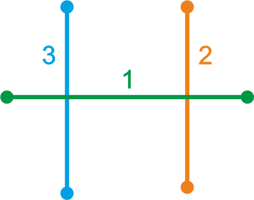

# shape-example-graphhopper

Данные для тестирования вставки в слой для GraphHopper

В файлах, идентификатор линии является её порядковым номером. **Обратите внимание, что при загрузке shape в БД, порядок может измениться.**

**Линии в файлах созданы с погрешностью!**

## intersect

 

```SQL
LINESTRING (66.06819599931458 57.25031281486611, 66.07962892895415 57.24961189436822)
LINESTRING (66.07467465944366 57.24771511084118, 66.07660555422723 57.25186587096982)
LINESTRING (66.07091449591776 57.24793501267562, 66.07284539070133 57.252085772804264)
```

## touch

 

```SQL
LINESTRING (66.0705309157101 57.24527360150914, 66.07343256241468 57.245098203103325)
LINESTRING (66.07235643890483 57.242784849768185, 66.0742873336884 57.24693560989683)
LINESTRING (66.06952685111628 57.24311520773335, 66.07145774589985 57.24726596786199)
```

## connect

 

```SQL
LINESTRING (66.08560876319738 57.25244373995595, 66.08753965798095 57.256594500084596)
LINESTRING (66.08753965798095 57.256594500084596, 66.09231271871428 57.25592856633441)
```

## double intersect

 

```SQL
LINESTRING (66.07099385168904 57.25677735269275, 66.0824267813286 57.25607643219486, 66.08159655274505 57.25403511945976, 66.07016532732945 57.254770192606465)
LINESTRING (66.07707281862174 57.25322829368533, 66.07900371340531 57.25737905381398)
LINESTRING (66.07335262441549 57.25351307776771, 66.07528351919906 57.25766383789635)
```

## ovarlay

 

```SQL
LINESTRING (66.08538280675765 57.24953439480238, 66.08938990291034 57.24927918041815, 66.0888363036685 57.24808912999145, 66.09225337259277 57.247818841140784)
LINESTRING (66.08832539117961 57.246976702670715, 66.0888363036685 57.24808912999145, 66.08938990291034 57.24927918041815, 66.08986476757377 57.25028096919833)
```

## full overlay

 

```SQL
LINESTRING (66.08940600324757 57.261858384708496, 66.09133689803114 57.26600914483714)
LINESTRING (66.08940600324757 57.261858384708496, 66.09133689803114 57.26600914483714)
```

## takeover

 

```SQL
LINESTRING (66.07672761498081 57.26239188124447, 66.07865850976438 57.266542641373114)
LINESTRING (66.07390708822307 57.26255804534766, 66.07672761498081 57.26239188124447, 66.07865850976438 57.266542641373114, 66.0830942123941 57.266323903248676)
```

## intersect and ovarlay

 

```SQL
LINESTRING (66.08198599745667 57.24084246059972, 66.08391689224024 57.24499322072837)
LINESTRING (66.08842105791791 57.24043156446273, 66.09035195270148 57.24458232459138)
LINESTRING (66.08543495372157 57.2406528941936, 66.08597857697147 57.24184140243735, 66.08652519755704 57.24301645820211, 66.08730896934819 57.2446631597154)
LINESTRING (66.08067362001596 57.243400820136934, 66.08652519755704 57.24301645820211, 66.08597857697147 57.24184140243735, 66.09066958830222 57.24151500487387)
```


